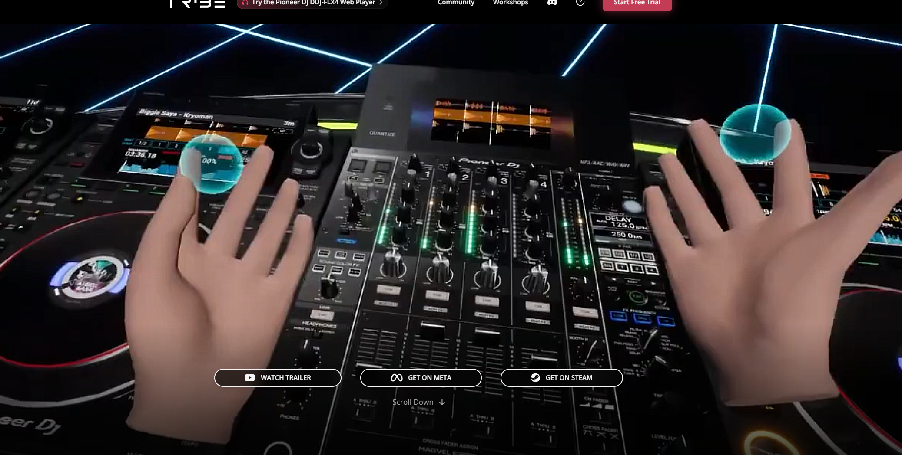

#### PEC3_Manovich_Reloaded
Ensayo sobre Tribe XR y PHASE como ejemplos de hibridación tecnológica según los principios de Lev Manovich.

# PEC3: Manovich Reloaded  
**Autor:** Grifol Guixot, Fco. De Borja

En esta PEC exploro dos ejemplos modernos de hibridación tecnológica que complementan los casos analizados en el libro *El software toma el mando* de Lev Manovich. Estos casos representan cómo la tecnología transforma disciplinas tradicionales y crea nuevas experiencias a través del software. 

Mi interés por este tema viene de que en estos momentos estoy aprendiendo Djing y me interesa tanto la técnica como su historía. Desde pequeño he estado rodeado de vinilos y equipos analógicos, y he podido observar cómo la tecnología ha cambiado por completo la forma en que se mezclan y producen las canciones. Esto, combinado con mi interés en las tecnologías emergentes como la realidad virtual, me llevó a elegir ejemplos que fusionan lo tradicional con lo digital. 

Como Lev Manovich afirma en su libro: *"El software se ha convertido en la interfaz universal de la cultura"*. Esta afirmación resuena con los dos ejemplos seleccionados, **Tribe XR** y **PHASE**, que muestran cómo el software no solo facilita las prácticas tradicionales, sino que las redefine y amplía, abriendo nuevas posibilidades creativas y culturales. 

---

## Caso 1: Tribe XR  

### Descripción  
**Tribe XR** es una plataforma de realidad virtual (VR) diseñada para enseñar y practicar DJing en un entorno completamente digital. Ofrece un set de controladores virtuales que simulan equipos físicos como mezcladores y reproductores CDJ, permitiendo a los usuarios interactuar con ellos a través de sus manos en el espacio virtual. Tribe XR también integra servicios como SoundCloud, facilitando el acceso a bibliotecas musicales extensas. 

Este software está disponible en dispositivos VR como Oculus Quest y PC VR, y permite realizar transmisiones en vivo desde el entorno virtual, conectando a los DJs con su audiencia en tiempo real. Además, ofrece sesiones educativas con DJs profesionales para ayudar a los usuarios a mejorar sus habilidades.

### Relación con los principios de Manovich
Tribe XR es un ejemplo claro de cómo el software puede transformar disciplinas tradicionales mediante la remediación. Traslada la experiencia del DJing físico a la realidad virtual, replicando equipos como mezcladores y reproductores mientras añade funcionalidades únicas del entorno digital, como transmisiones en vivo y personalización de entornos. Cada componente de Tribe XR opera de forma modular, imitando fielmente sus contrapartes físicas, lo que permite a los usuarios interactuar con equipos virtuales como si fueran reales. Además, la automatización simplifica procesos complejos, como la sincronización de pistas, haciendo que incluso los principiantes puedan aprender de forma accesible. La variabilidad, al permitir entornos completamente personalizables, y la eliminación de barreras económicas y logísticas, hacen de Tribe XR un gran ejemplo de cómo el software democratiza el acceso a prácticas creativas.

[Ver video demostrativo de Tribe XR en YouTube](https://www.youtube.com/watch?v=jPEDi0tm7ss)
<iframe width="560" height="315" src="https://www.youtube.com/watch?v=jPEDi0tm7ss" frameborder="0" allowfullscreen></iframe>
<iframe width="320" height="180" src="https://www.youtube.com/watch?v=jPEDi0tm7ss" title="PHASE" frameborder="0" allow="accelerometer; autoplay; clipboard-write; encrypted-media; gyroscope; picture-in-picture" allowfullscreen="1"></iframe>

---

## Caso 2: PHASE  

### Descripción  
**PHASE** es un sistema inalámbrico diseñado para DJs que combina la experiencia táctil del vinilo con la precisión del software digital. El sistema utiliza pequeños transmisores que se colocan sobre los discos de vinilo y envían señales al software de DJ, replicando los movimientos del vinilo en tiempo real sin necesidad de agujas físicas.

PHASE es compatible con los principales programas de DJing, como Serato y Traktor, y elimina problemas comunes asociados con los tocadiscos tradicionales, como el desgaste de las agujas o la interferencia por vibraciones.

### Relación con los principios de Manovich
PHASE combina lo analógico y lo digital para modernizar la práctica del DJing. Este sistema remedia la experiencia del vinilo, preservando su tactilidad mientras elimina limitaciones como el desgaste de agujas o los problemas derivados de vibraciones. Gracias a la transcodificación, convierte los movimientos físicos del vinilo en datos digitales procesados con precisión por el software, garantizando un control fluido y exacto. La automatización facilita la conexión entre los transmisores y el software, eliminando problemas técnicos que eran comunes en sistemas tradicionales. Con una arquitectura modular, cada componente de PHASE funciona como una pieza independiente que se integra perfectamente en el ecosistema del DJ. Este equilibrio entre lo clásico y lo moderno, junto con su portabilidad y facilidad de uso, posiciona a PHASE como un ejemplo perfecto de cómo la tecnología hibrida disciplinas tradicionales.

---

## Conclusión  
**Tribe XR** y **PHASE** son ejemplos destacados de hibridación tecnológica que muestran cómo el software puede transformar y modernizar disciplinas tradicionales como el DJing. Mientras Tribe XR lleva el DJing a un entorno completamente digital e inmersivo, PHASE fusiona lo analógico y lo digital, manteniendo la esencia del vinilo con las ventajas del software moderno. Ambos casos ilustran perfectamente los principios de Manovich, demostrando cómo la tecnología no solo remedia prácticas existentes, sino que también abre nuevas posibilidades creativas y culturales.

---

## Referencias  
- [Página oficial de Tribe XR](https://www.tribexr.com)  
- [Página oficial de PHASE](https://www.phasedj.com)  
- Manovich, Lev. *El software toma el mando*.  

- Recursos adicionales: Videos y documentación relacionados con Tribe XR y PHASE.
